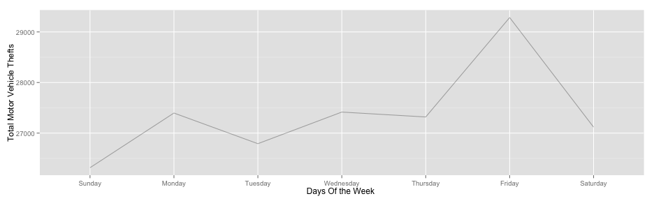
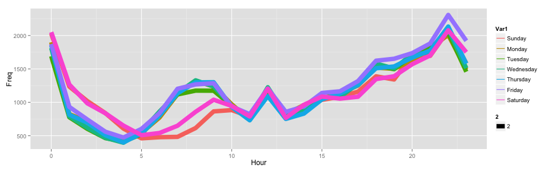

## Chicago Motor Vehicle Theft Analytic

**What is happening**   
1. Vehicle theft cases getting more and more   
2. Area of coverage getting bigger as continuous development and expansion on the city landscape.  


```r
mvt = read.csv(src_file, stringsAsFactors=FALSE);
mvt$Date = strptime(mvt$Date, format ="%m/%d/%y %H:%M");
mvt$Weekday = weekdays(mvt$Date); mvt$Hour = mvt$Date$hour;
str(mvt)
```

```
## 'data.frame':	191641 obs. of  5 variables:
##  $ Date     : POSIXlt, format: "2012-12-31 23:15:00" "2012-12-31 22:00:00" ...
##  $ Latitude : num  41.8 41.9 42 41.8 41.8 ...
##  $ Longitude: num  -87.6 -87.7 -87.8 -87.7 -87.6 ...
##  $ Weekday  : chr  "Monday" "Monday" "Monday" "Monday" ...
##  $ Hour     : int  23 22 22 22 21 20 20 20 19 18 ...
```
[Data File](https://github.com/BellyTheMagnificent/Slidify_Presentation/blob/master/Slidify_Presentation/data/mvt.csv) 

---  .class #id 

## Chicago Crime (Weekly)
Most of the theft cases are happen on Friday!


```r
ggplot(WeekdayCounts, aes (x = Var1, y = Freq)) + geom_line(aes(group=1), alpha=0.3) + 
                 xlab("Days Of the Week ") + ylab("Total Motor Vehicle Thefts")
```

 

---  .class #id 
   
## Chicago Crime Analytic (Hourly)
From the hourly view of the data, we can conclude that vehicle thefts are active during late night, between 12 am to 1am.


```r
ggplot(DayHourCounts,aes(x=Hour,y=Freq,color=Var1,size=1)) + geom_line(aes(group=Var1))
```

 

---  .class #id 
   
## Chicago Mobile Vehicle Theft (Location)
Visualizing data using Google map do show the are areas which frequently trouble by the theft cases. Perhaps the police department could deploy more forces on this area.


```r
ggmap(chicago) + geom_tile(data=LatLonCounts, aes(x=Long, y=Lat, alpha=Freq), fill="red") + 
         xlab("Longitude") + ylab("Latitude")
```

 
